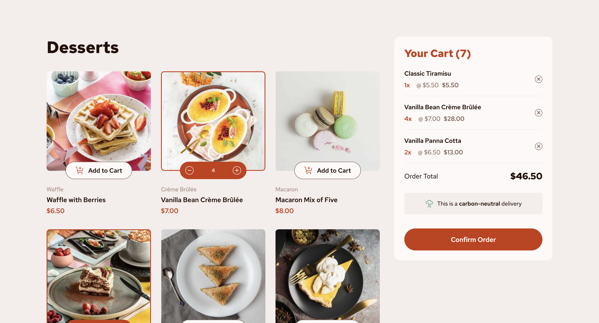

# SweetSpot

## Table of contents

- [Overview](#overview)
  - [The challenge](#the-challenge)
  - [Screenshot](#screenshot)
  - [Links](#links)
- [My process](#my-process)
  - [Built with](#built-with)
  - [Continued development](#continued-development)
  - [Useful resources](#useful-resources)
- [Author](#author)
- [Acknowledgments](#acknowledgments)

## Overview

### The challenge

Users should be able to:

- Add items to the cart and remove them
- Increase/decrease the number of items in the cart
- See an order confirmation modal when they click "Confirm Order"
- Reset their selections when they click "Start New Order"
- View the optimal layout for the interface depending on their device's screen size
- See hover and focus states for all interactive elements on the page

### Screenshot

### Links

- [GitHub repo](https://github.com/Aymmaann/SweetSpot)
- [Live Site](https://sweetspot-dessert.netlify.app/)

## My process

### Built with

- Semantic HTML5 markup
- CSS custom properties
- Flexbox
- CSS Grid
- Mobile-first workflow

### Continued development

I'm focusing on implementing smoother transitions and animations, particularly when toggling elements like the bill overlay (overlayBill) and updating the cart. These enhancements are crucial for delivering a polished and engaging user experience.
Strengthening error handling with clear error messages and implementing robust input validation across user interactions. This ensures the application remains stable and resilient against unexpected user inputs.

### Continued development

Accessibility remains a priority in the project's development. Recent updates focused on improving screen reader compatibility, and ensuring compliance with web accessibility standards (WCAG). These efforts aim to make the application accessible to users with disabilities, promoting inclusivity and usability for all.

To enhance the application's performance, several optimizations were implemented. This includes efficient data fetching and rendering techniques, minimizing unnecessary reflows and repaints, and optimizing JavaScript functions to handle data manipulation and UI updates more effectively.

### Useful resources

- [MDN Web Docs](https://developer.mozilla.org/) - Comprehensive web development documentation
- [Frontend Mentor](https://www.frontendmentor.io/challenges) - Platform for practicing frontend coding challenges
- [CSS Tricks](https://css-tricks.com/) - Helpful tips and tricks for CSS styling and layout

## Author

- Website - [My portfolio](https://ayman03-portfolio.netlify.app/)
- Frontend Mentor - [@Aymmaann](https://www.frontendmentor.io/profile/Aymmaann)
## Acknowledgements

 - [Awesome Readme Templates](https://awesomeopensource.com/project/elangosundar/awesome-README-templates)
 - [Awesome README](https://github.com/matiassingers/awesome-readme)
 - [How to write a Good readme](https://bulldogjob.com/news/449-how-to-write-a-good-readme-for-your-github-project)

